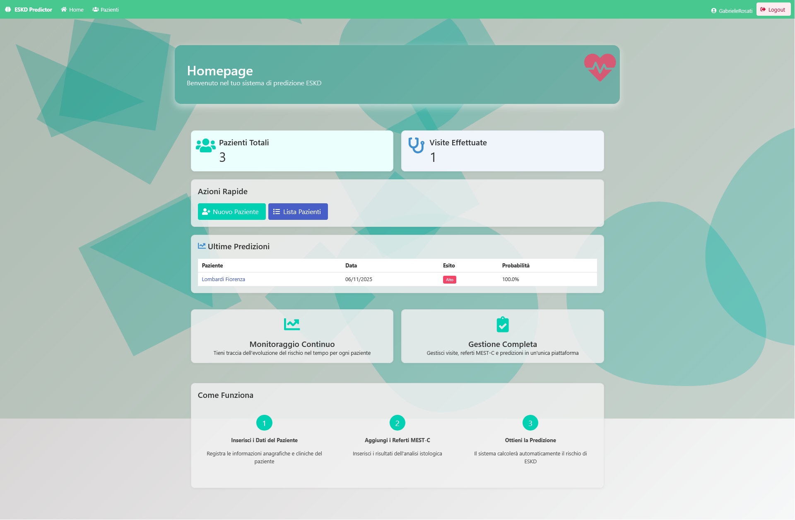
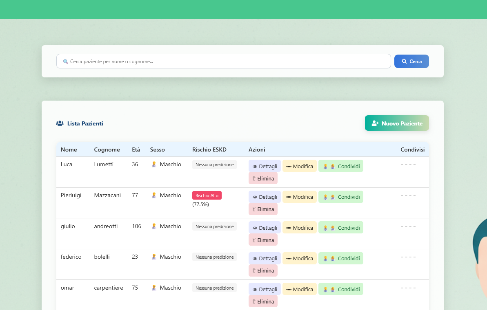

# 🏥 ESKD Risk Classification Web App

A full-stack **Django web application** for patient management and **End-Stage Kidney Disease (ESKD)** risk classification based on clinical and laboratory data.  
This project integrates data entry, risk prediction through a machine-learning model, and visualization of patient-specific results — all within a single, secure platform.

## 🧭 Overview

This Django application is designed to support healthcare professionals in managing patient records and predicting the likelihood of progression to **End-Stage Kidney Disease (ESKD)**.  
It combines **clinical data management**, **automated classification**, and **data visualization** in a single interface.

### Main objectives
- Centralize patient information and laboratory results.  
- Enable physicians to run an integrated **ESKD classification model**.  
- Store predictions and visualize them in the patient dashboard.  
- Provide an extendable foundation for research and hospital integration.

---

## ✨ Key Features

- **User authentication and authorization** (via Django Auth).  
- **Patient CRUD** (Create, Read, Update, Delete) operations.  
- **ESKD risk prediction** using an integrated ML classifier.  
- **Dynamic dashboard** with patient history and risk visualization.  
- **Local storage** for medical reports and uploaded images.  
- **Audit logs** for predictions and user actions.  

---

## 👥 Actors and Roles

|  Actor | Description  | Permissions |
|--------|--------------|-------------|
| **Administrator** | Manages users, roles, and global configurations. | Full access (user and system management). |
| **Physician / Clinician** | Manages patient records and performs risk classification. | Create/update patients, trigger ML predictions, view results. |
| **Researcher** | Analyzes aggregated or anonymized results. | Read-only access to data summaries and statistics. |
| **Patient (optional)** | Can view their own data (if allowed). | Read-only self-access. |

---

## ⚙️ Architecture Overview

Below is a simplified overview of how the system components interact in production.  
Django acts as both **frontend and backend**, handling authentication, database operations, and HTML rendering.
The use of Docker simplifies the portability and usage of the web application, specifically, I adopted 4 separate containers:
- One for Django and Gunicorn
- One for NGINX
- One for Dramatiq (to handle in background multiple request of the Eskd prediction)
- One for Redis
After that, the use of Https ensure the encryption of the data (Certbot to have the SSL certificate from Let's Encrypt).

         ┌─────────────────────────────┐
         │         Web Client          │
         │   (User Browser / HTTPS)    │
         │                             │
         └──────────────┬──────────────┘
                        │ Sends requests 
                        │ to Web Server  
                        ▼
         ┌─────────────────────────────┐
         │            NGINX            │
         │ Reverse Proxy & Static Host │
         └──────────────┬──────────────┘
                        │ Forwards to ...
                        │   
                        ▼
         ┌─────────────────────────────┐
         │          Gunicorn           │
         │  WSGI Application Server    │
         └──────────────┬──────────────┘
                        │ Via WSGI protocol
                        ▼ forwards to Django
         ┌─────────────────────────────┐
         │          Django             │
         │  Backend + Frontend Logic   │
         │ - Authentication            │
         │ - Database Access           │
         │ - ESKD CNN Prediction       │
         │   (Dramatiq + Redis)        │
         │ - Template Rendering (HTML) │
         └──────────────┬──────────────┘

The HTML rendered by Django is then propagated back through the entire pipeline: it is first returned to Gunicorn, then passed to the web server (NGINX), and finally delivered to the browser, which displays the Django-generated frontend with the computed results. 
---

### 🔍 Description

1. **User (Browser)**  
   - Accesses the web interface over HTTPS.  
   - Interacts with Django-rendered HTML pages.  

2. **NGINX**
   - It is like a filter from the user and the backend.
   - Acts as reverse proxy and handles SSL termination.  
   - Serves static and media files directly.  

3. **Gunicorn**  
   - WSGI server that runs the Django application.  
   - Passes requests/responses between NGINX and Django.  

4. **Django (Full-stack)**  
   - Manages business logic, user authentication, and rendering.  
   - Handles ORM operations for the database.  
   - Invokes the **ESKD classifier** for risk predictions.
   - Works with Dramatiq and Redis for prediction handling

5. **PostgreSQL Database**  
   - Stores patient data, predictions, and user accounts.  

6. **ML Model (Python)**  
   - Processes clinical data and returns risk classification results.  

7. **Local Storage**  
   - Keeps uploaded medical reports and images.  

---

## 🖼️ Some Screenshots

### 🔐 Dashboard Page

### 🏥 Patient List

### 🧠 Patient Details

### 🤖 ESKD Predictor

